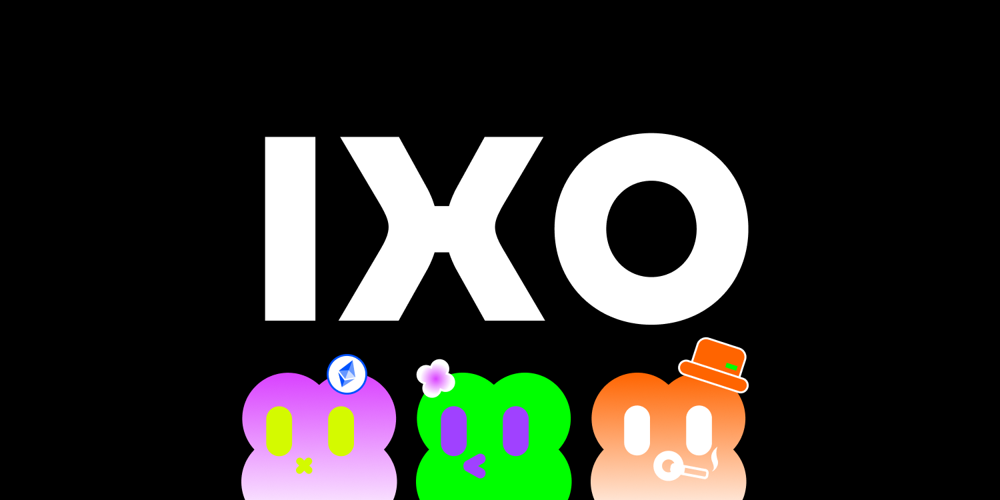
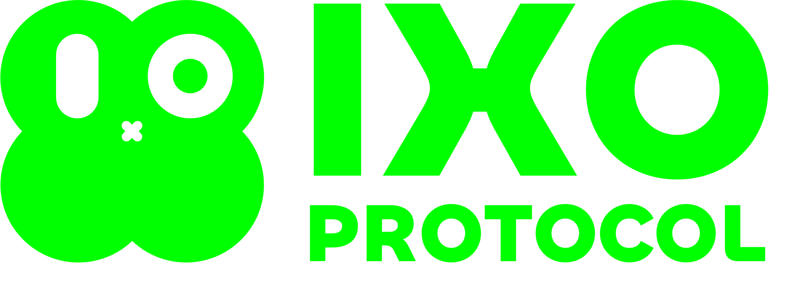
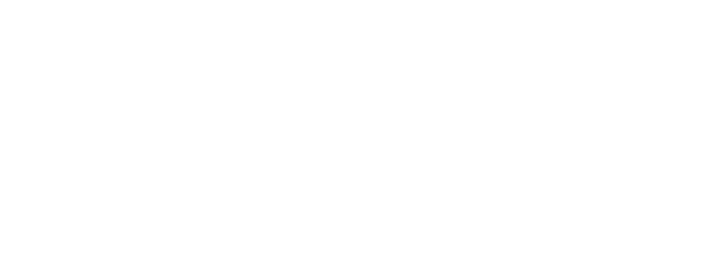

# IXO Protocol brand-kit

This repo contains [brand](guides/brand-guide.pdf) and [editorial style](guides/editorial-style-guide.md) guides for IXO Protocol.

IXO Protocol is the fully decentralized trading protocol focusing on over-the-counter (OTC) markets, specializing in pre-marketing, vesting (locked), and secondary assets.

### Guides

- [Brand Guide](guides/brand-guide.pdf)

### Logos

| Symbol                                           | Wordmark                                               |
| ------------------------------------------------ | ------------------------------------------------------ |
|  |  |
|  |  |
|  |  |
